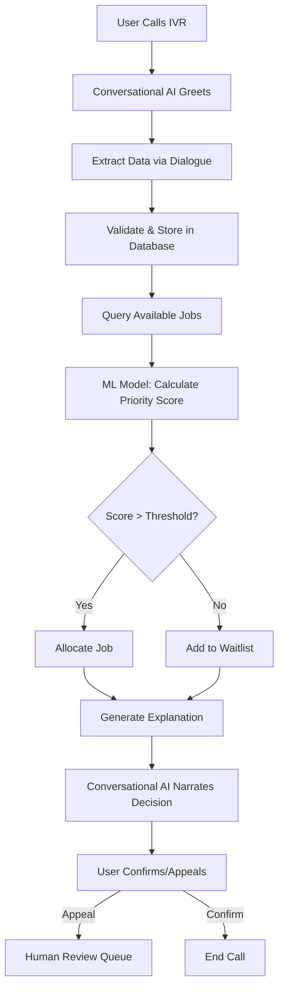

# MGNREGA ML/DL Model Requirements Document
## End-to-End Data Collection, Prediction, Allocation & Explainability Framework

**Version:** 1.0  
**Date:** January 30, 2026  
**For:** SAHAYOG 2026 - MGNREGA Fair Allocation System  
**Purpose:** Complete specification for ML/DL models supporting conversational AI-driven decision-making

---

## Table of Contents

1. [Executive Summary](#executive-summary)
2. [Data Requirements - What to Track](#data-requirements)
3. [Conversational AI Data Extraction](#conversational-ai-extraction)
4. [Feature Engineering & Weighting](#feature-engineering)
5. [ML/DL Model Architecture](#model-architecture)
6. [Prediction Targets](#prediction-targets)
7. [Fairness & Bias Mitigation](#fairness-bias)
8. [Explainability Framework](#explainability)
9. [Integration with Conversational AI](#conversational-integration)
10. [Implementation Roadmap](#implementation)

---

## 1. Executive Summary {#executive-summary}

This document defines the complete requirements for ML/DL models that power fair, transparent, fraud-resistant MGNREGA work allocation through conversational AI. The system:

- **Collects** comprehensive data via voice conversations (22 languages)
- **Tracks** work patterns, personal circumstances, vulnerability indicators
- **Predicts** allocation priority, fraud risk, vulnerability scores
- **Ensures** fairness across caste, gender, geography, disability dimensions
- **Explains** every decision in human terms via conversational AI
- **Adapts** continuously based on outcomes and feedback

**Core Philosophy:** Every data point serves dual purposes:
1. **Immediate:** Support current allocation decision
2. **Predictive:** Train models for future fairness and fraud detection

---

## 2. Data Requirements - What to Track {#data-requirements}

### 2.1 Core Identity & Demographics

**Mandatory Fields (Database Requirements):**

| Field | Type | Source | Update Frequency | Purpose |
|-------|------|--------|------------------|---------|
| `aadhaar_hash` | String(64) | UIDAI | Static | Deduplication |
| `name` | String(200) | Aadhaar | Verification | Identity |
| `date_of_birth` | Date | Aadhaar | Static | Age-based priority |
| `gender` | Enum(M/F/O) | Aadhaar | Static | Gender quota enforcement |
| `caste_category` | Enum(SC/ST/OBC/Gen) | SECC | Static | Reservation quota |
| `disability_status` | Boolean | UDID | Annual | Priority allocation |
| `disability_type` | Enum | UDID | Annual | Work adaptation |
| `disability_percentage` | Integer(0-100) | UDID | Annual | Priority weighting |

**ML Feature Extraction:**
```python
features['age'] = (current_date - date_of_birth).days / 365.25
features['is_youth'] = 1 if 18 <= features['age'] <= 25 else 0
features['is_elderly'] = 1 if features['age'] >= 55 else 0
features['is_vulnerable_caste'] = 1 if caste_category in ['SC', 'ST'] else 0
features['is_woman'] = 1 if gender == 'F' else 0
features['disability_severity'] = disability_percentage / 100.0
```

---

### 2.2 Geographic & Household Context

**Database Fields:**

| Field | Type | Source | Purpose |
|-------|------|--------|---------|
| `village_code` | String(20) | LGD | Work proximity |
| `hamlet_name` | String(100) | Self-reported | Remote area priority |
| `gps_latitude` | Float | Mobile/CSC | Distance calculation |
| `gps_longitude` | Float | Mobile/CSC | Distance calculation |
| `household_id` | UUID | Linked | Family analysis |
| `household_size` | Integer | Self-reported | Dependency ratio |
| `num_children` | Integer | Conversational AI | Child care burden |
| `num_elderly` | Integer | Conversational AI | Care responsibilities |
| `num_earners` | Integer | Conversational AI | Economic stress |
| `is_single_parent` | Boolean | Conversational AI | Vulnerability |
| `house_type` | Enum(Kuccha/Semi/Pucca) | SECC | Poverty indicator |
| `land_ownership_hectares` | Float | SECC/Land Records | Economic status |

**Conversational AI Extraction Example:**
```
AI: "आपके घर में कितने सदस्य हैं?" (How many people in your household?)
User: "6 - मैं, मेरी पत्नी, 3 बच्चे और मेरी माँ"
AI extracts: household_size=6, num_children=3, num_elderly=1, num_earners=1
```

**ML Features:**
```python
features['dependency_ratio'] = (num_children + num_elderly) / max(num_earners, 1)
features['per_capita_earners'] = num_earners / household_size
features['is_remote_hamlet'] = 1 if distance_to_gp_office > 5 else 0  # km
features['housing_deprivation'] = 1 if house_type == 'Kuccha' else 0
features['is_landless'] = 1 if land_ownership_hectares < 0.5 else 0
```

---

### 2.3 Employment & Income Tracking

**Critical Time-Series Data:**

| Field | Type | Update | Purpose |
|-------|------|--------|---------|
| `days_worked_current_year` | Integer | Daily | Rotation fairness |
| `last_work_date` | Date | Daily | Unemployment duration |
| `unemployment_days_continuous` | Integer | Computed | Priority scoring |
| `total_wages_earned_ytd` | Float | Per payment | Income verification |
| `avg_daily_wage_received` | Float | Computed | Wage theft detection |
| `payment_delay_days_avg` | Float | Computed | System performance |
| `work_quality_rating` | Float(0-5) | Per work | Skill matching |
| `attendance_rate` | Float(0-1) | Computed | Ghost detection |
| `seasonal_work_pattern` | JSON | ML-computed | Demand forecasting |

**Conversational AI Tracking:**
```
AI: "आपको आखिरी बार कब काम मिला था?" (When did you last get work?)
User: "2 महीने पहले, 15 दिन काम किया था"
AI: "क्या आपको पूरी मजदूरी मिली?"
User: "नहीं, अभी तक 3000 रुपये बाकी हैं"

Extracted:
- last_work_date = 60 days ago
- days_worked_last_stint = 15
- pending_wages = 3000
- payment_delay_flag = True
```

**ML Features:**
```python
features['days_since_last_work'] = (current_date - last_work_date).days
features['unemployment_score'] = min(days_since_last_work / 365.0, 1.0)
features['work_gap_severe'] = 1 if days_since_last_work > 90 else 0
features['days_remaining_entitlement'] = max(100 - days_worked_current_year, 0)
features['wage_theft_indicator'] = 1 if payment_delay_days_avg > 15 else 0
features['attendance_anomaly'] = 1 if attendance_rate > 0.98 else 0  # Too perfect = fraud
```

---

### 2.4 Financial & Economic Stress

**Database Fields:**

| Field | Type | Source | Purpose |
|-------|------|--------|---------|
| `bank_account_status` | Enum(Active/Dormant/None) | NPCI | Payment capability |
| `has_bank_account` | Boolean | PMJDY | Financial inclusion |
| `debt_level_reported` | Enum(None/Low/Med/High) | Conversational AI | Stress indicator |
| `loan_from_moneylender` | Boolean | Conversational AI | Predatory debt |
| `ration_card_type` | Enum(AAY/PHH/APL) | PDS | Poverty level |
| `bpl_status` | Boolean | SECC | Priority |
| `secc_deprivation_score` | Integer(0-7) | SECC | Multi-dimensional poverty |
| `monthly_income_estimate` | Float | Conversational AI | Need assessment |
| `income_sources` | JSON | Conversational AI | Livelihood diversity |

**Conversational AI Pain Point Extraction:**
```
AI: "क्या आपके परिवार पर कोई कर्जा है?" (Does your family have debt?)
User: "हाँ, साहूकार से 50,000 रुपये लिए हैं"
AI: "ब्याज दर क्या है?" (What's the interest rate?)
User: "5% हर महीने" (5% per month = 60% annual - predatory)

Extracted:
- debt_level_reported = 'High'
- loan_from_moneylender = True
- debt_amount = 50000
- interest_rate_annual = 60%
- financial_stress_score = 0.9  # High urgency
```

**ML Features:**
```python
features['poverty_score'] = secc_deprivation_score / 7.0
features['is_extreme_poor'] = 1 if ration_card_type == 'AAY' else 0
features['financial_stress'] = (
    0.4 * (1 if debt_level_reported in ['High', 'Med'] else 0) +
    0.3 * (1 if loan_from_moneylender else 0) +
    0.3 * (1 if monthly_income_estimate < 5000 else 0)
)
features['has_financial_exclusion'] = 1 if not has_bank_account else 0
```

---

### 2.5 Skills & Capability Profile

**Database Fields:**

| Field | Type | Source | Purpose |
|-------|------|--------|---------|
| `skills_declared` | String[] | e-Shram/Self | Job matching |
| `skills_verified` | String[] | RPL Assessment | Credible matching |
| `literacy_level` | Enum(Illiterate/Functional/Literate) | Self-reported | Communication mode |
| `digital_literacy` | Boolean | Observed | Interface adaptation |
| `primary_occupation` | String | SECC/e-Shram | Skill category |
| `training_completed` | JSON | PMKVY/NRLM | Upskilling status |
| `preferred_work_types` | String[] | Conversational AI | Preference matching |
| `physical_capacity` | Enum(Light/Moderate/Heavy) | Self + Disability | Work allocation |
| `can_migrate_for_work` | Boolean | Conversational AI | Geographic flexibility |
| `max_travel_distance_km` | Float | Conversational AI | Work proximity |

**Conversational AI Skill Extraction:**
```
AI: "आप कौन सा काम जानते हैं?" (What work do you know?)
User: "मैं राज और ईंट का काम कर सकता हूँ, पहले construction site पर काम किया है"

AI: "आप कितनी दूर तक काम के लिए जा सकते हैं?"
User: "5 किलोमीटर से ज्यादा नहीं, बच्चों की देखभाल के लिए"

Extracted:
- skills_declared = ['masonry', 'construction', 'manual_labor']
- max_travel_distance_km = 5.0
- care_responsibilities = True
- physical_capacity = 'Moderate'
```

**ML Features:**
```python
features['skill_count'] = len(skills_verified) if skills_verified else len(skills_declared)
features['is_skilled_worker'] = 1 if skill_count > 0 else 0
features['has_care_constraints'] = 1 if max_travel_distance_km < 5 else 0
features['is_illiterate'] = 1 if literacy_level == 'Illiterate' else 0
features['needs_training'] = 1 if len(skills_verified) == 0 else 0
```

---

### 2.6 Vulnerability & Life Events

**Critical Pain Points to Track:**

| Field | Type | Source | Weight in Allocation | Why Track |
|-------|------|--------|---------------------|-----------|
| `is_widow` | Boolean | Conversational AI | 0.15 | Single income, social vulnerability |
| `is_single_mother` | Boolean | Conversational AI | 0.15 | Economic + care burden |
| `is_abandoned_spouse` | Boolean | Conversational AI | 0.12 | Social + economic crisis |
| `recent_death_in_family` | Boolean | Conversational AI | 0.10 | Emotional trauma + income loss |
| `recent_illness_major` | Boolean | Conversational AI | 0.10 | Medical debt + lost workdays |
| `recent_crop_failure` | Boolean | GIS + Self-report | 0.08 | Seasonal livelihood shock |
| `migration_returnee` | Boolean | Conversational AI | 0.08 | Re-integration difficulty |
| `child_out_of_school` | Boolean | Conversational AI | 0.07 | Intergenerational poverty risk |
| `domestic_violence_indicator` | Boolean | Counselor referral | 0.05 | Safety + economic control |
| `mental_health_risk_score` | Float(0-1) | ML-computed | 0.05 | Wellbeing intervention |

**Conversational AI Empathetic Extraction:**
```
AI: "मुझे आपकी स्थिति समझने में मदद करें - क्या पिछले साल में कोई बड़ी समस्या आई?"
(Help me understand your situation - did any major problem occur last year?)

User: "मेरे पति की 6 महीने पहले मृत्यु हो गई, अब मुझे अकेले 3 बच्चों को पालना है"
(My husband died 6 months ago, now I have to raise 3 children alone)

AI: "मुझे बहुत दुख है। क्या आपको कोई पेंशन या सहायता मिल रही है?"
(I'm very sorry. Are you receiving any pension or assistance?)

User: "नहीं, widow pension के लिए apply किया था पर अभी तक नहीं मिली"

Extracted:
- is_widow = True
- is_single_mother = True
- recent_death_in_family = True
- num_children = 3
- num_earners = 1 (only self)
- pending_widow_pension = True
- vulnerability_score = 0.95  # Extremely high priority
- requires_immediate_intervention = True
```

**ML Vulnerability Composite Score:**
```python
def calculate_vulnerability_score(person):
    """Multi-dimensional vulnerability assessment"""
    score = 0.0
    
    # Social vulnerability
    if person.is_widow: score += 0.15
    if person.is_single_mother: score += 0.15
    if person.is_abandoned_spouse: score += 0.12
    
    # Economic shocks
    if person.recent_death_in_family: score += 0.10
    if person.recent_illness_major: score += 0.10
    if person.recent_crop_failure: score += 0.08
    
    # Life transitions
    if person.migration_returnee: score += 0.08
    
    # Structural vulnerability
    if person.caste_category in ['SC', 'ST']: score += 0.07
    if person.is_disabled: score += 0.10
    if person.child_out_of_school: score += 0.05
    
    # Mental health
    score += person.mental_health_risk_score * 0.05
    
    return min(score, 1.0)  # Cap at 1.0

features['vulnerability_composite'] = calculate_vulnerability_score(person)
```

---

### 2.7 Behavioral & Engagement Patterns

**Track User Interaction with System:**

| Field | Type | Purpose |
|-------|------|---------|
| `registration_date` | DateTime | System familiarity |
| `app_login_count` | Integer | Digital engagement |
| `ivr_call_count` | Integer | Voice preference |
| `grievance_filed_count` | Integer | Assertiveness / Issues |
| `grievance_resolution_rate` | Float(0-1) | System responsiveness |
| `training_modules_completed` | Integer | Upskilling engagement |
| `last_interaction_date` | DateTime | Dropout risk |
| `preferred_language` | String | Communication effectiveness |
| `preferred_contact_time` | TimeRange | Accessibility |
| `sms_response_rate` | Float(0-1) | Notification effectiveness |

**ML Features for Dropout Prediction:**
```python
features['days_since_interaction'] = (current_date - last_interaction_date).days
features['is_disengaged'] = 1 if days_since_interaction > 90 else 0
features['is_active_user'] = 1 if app_login_count + ivr_call_count > 10 else 0
features['has_unresolved_grievances'] = 1 if grievance_resolution_rate < 0.5 else 0
features['dropout_risk'] = predict_dropout_risk(person)  # ML model
```

---

### 2.8 Work Performance & History

**Track for Quality & Fraud Detection:**

| Field | Type | Purpose |
|-------|------|---------|
| `total_works_completed` | Integer | Experience |
| `work_completion_rate` | Float(0-1) | Reliability |
| `supervisor_rating_avg` | Float(1-5) | Quality |
| `peer_rating_avg` | Float(1-5) | Teamwork |
| `worksite_attendance_pattern` | JSON | Ghost detection |
| `gps_verified_attendance` | Boolean[] | Location fraud |
| `biometric_auth_failures` | Integer | Identity fraud |
| `same_day_multi_location_flags` | Integer | Duplicate claims |
| `wage_received_vs_expected` | Float | Wage theft detection |

**Fraud Detection Features:**
```python
features['attendance_too_perfect'] = 1 if work_completion_rate > 0.98 else 0
features['biometric_failure_rate'] = biometric_auth_failures / max(total_works_completed, 1)
features['location_fraud_score'] = same_day_multi_location_flags / 365.0
features['wage_discrepancy'] = abs(wage_received_vs_expected - 1.0)
features['ghost_probability'] = predict_ghost_beneficiary(person)  # ML model
```

---

## 3. Conversational AI Data Extraction {#conversational-ai-extraction}

### 3.1 Multi-Turn Dialogue Strategy

**Conversational Flow for Comprehensive Data Collection:**

```yaml
dialogue_structure:
  stage_1_identity:
    - Verify: Aadhaar, Name, Village
    - Auto-fetch: Age, Gender, Caste from database
    - Validate: Phone number (OTP)
  
  stage_2_household:
    questions:
      - "आपके परिवार में कितने सदस्य हैं?" (Household size)
      - "कितने बच्चे हैं और उनकी उम्र?" (Children count + ages)
      - "क्या कोई बुजुर्ग या बीमार सदस्य हैं?" (Elderly/sick members)
      - "घर में कितने लोग काम करते हैं?" (Number of earners)
    extracts:
      - household_size, num_children, num_elderly, num_earners
      - dependency_ratio (computed)
  
  stage_3_economic:
    questions:
      - "आपके परिवार की महीने की कमाई कितनी है?" (Monthly income)
      - "क्या आपके पास खेती की जमीन है?" (Land ownership)
      - "क्या कोई कर्जा है?" (Debt status)
      - "क्या आप BPL कार्ड धारक हैं?" (BPL status)
    extracts:
      - monthly_income_estimate, land_ownership_hectares
      - debt_level_reported, loan_from_moneylender
      - bpl_status
  
  stage_4_employment:
    questions:
      - "आपको आखिरी बार कब काम मिला?" (Last work date)
      - "इस साल कितने दिन काम किया?" (Days worked this year)
      - "क्या आपको पूरी मजदूरी मिली?" (Wage payment complete?)
      - "आप कौन सा काम जानते हैं?" (Skills)
    extracts:
      - last_work_date, unemployment_days_continuous
      - days_worked_current_year
      - payment_delay_flag, pending_wages
      - skills_declared
  
  stage_5_vulnerability:
    empathetic_intro: "मुझे आपकी मदद करनी है, कृपया अपनी समस्याएं बताएं"
    questions:
      - "क्या पिछले साल कोई बड़ी समस्या आई?" (Major life events)
      - "क्या परिवार में कोई बीमारी है?" (Health issues)
      - "बच्चे स्कूल जाते हैं?" (Education)
      - "क्या आपको काम के लिए दूर जाना पड़ता है?" (Migration)
    extracts:
      - recent_death_in_family, recent_illness_major
      - is_widow, is_single_mother
      - child_out_of_school
      - migration_returnee
  
  stage_6_preferences:
    questions:
      - "आप किस तरह का काम करना चाहेंगे?" (Preferred work type)
      - "आप कितनी दूर तक जा सकते हैं?" (Max travel distance)
      - "आप कौन से दिन काम कर सकते हैं?" (Availability)
    extracts:
      - preferred_work_types
      - max_travel_distance_km
      - availability_days_per_week
```

### 3.2 Real-Time Field Validation

**As data is extracted, validate immediately:**

```python
class ConversationalDataValidator:
    def validate_and_correct(self, field, value, context):
        """Real-time validation with conversational correction"""
        
        if field == 'phone_number':
            if not self.is_valid_indian_mobile(value):
                return {
                    'valid': False,
                    'ai_response': "क्षमा करें, यह नंबर सही नहीं लग रहा। कृपया 10 अंक का मोबाइल नंबर दें।",
                    'retry': True
                }
        
        if field == 'monthly_income_estimate':
            if value > 50000:  # Unlikely for MGNREGA beneficiary
                return {
                    'valid': False,
                    'ai_response': "क्या आप फिर से बता सकते हैं? यह राशि बहुत ज्यादा लग रही है।",
                    'retry': True
                }
        
        if field == 'days_worked_current_year':
            if value > 100:
                return {
                    'valid': False,
                    'ai_response': "MGNREGA में अधिकतम 100 दिन काम मिल सकता है। कृपया फिर से बताएं।",
                    'retry': True
                }
        
        # Cross-field validation
        if field == 'num_earners' and value > context['household_size']:
            return {
                'valid': False,
                'ai_response': "कमाने वाले सदस्य, परिवार के कुल सदस्यों से ज्यादा नहीं हो सकते।",
                'retry': True
            }
        
        return {'valid': True, 'value': value}
```

### 3.3 Missing Data Handling

**When critical data is missing:**

```python
class MissingDataHandler:
    def handle_missing(self, field, person_record):
        """Infer or prompt for missing critical data"""
        
        if field == 'unemployment_days_continuous':
            if person_record.last_work_date:
                # Infer from last work date
                return (datetime.now() - person_record.last_work_date).days
            else:
                # Prompt via AI
                return self.prompt_conversational(
                    "कितने दिन हुए आपको काम नहीं मिला है?",
                    expected_type='integer'
                )
        
        if field == 'vulnerability_score':
            # Use ML imputation based on similar profiles
            similar_profiles = self.find_similar_beneficiaries(person_record)
            return np.mean([p.vulnerability_score for p in similar_profiles])
        
        if field == 'max_travel_distance_km':
            # Use gender-based defaults
            if person_record.gender == 'F':
                return 3.0  # Conservative default for women
            else:
                return 10.0  # Default for men
```

---

## 4. Feature Engineering & Weighting {#feature-engineering}

### 4.1 Allocation Priority Score Formula

**Multi-dimensional weighted composite:**

```python
def calculate_priority_score(person, weights):
    """
    Final score: 0.0 (lowest priority) to 1.0 (highest priority)
    
    Weights are policy-configurable for transparency and adaptability
    """
    
    score = 0.0
    breakdown = {}  # For explainability
    
    # 1. VULNERABILITY (30% weight)
    vulnerability_score = calculate_vulnerability_score(person)
    score += weights['vulnerability'] * vulnerability_score
    breakdown['vulnerability'] = {
        'raw': vulnerability_score,
        'weight': weights['vulnerability'],
        'contribution': weights['vulnerability'] * vulnerability_score
    }
    
    # 2. UNEMPLOYMENT DURATION (20% weight)
    unemployment_score = min(person.unemployment_days_continuous / 365.0, 1.0)
    score += weights['unemployment'] * unemployment_score
    breakdown['unemployment'] = {
        'raw': person.unemployment_days_continuous,
        'normalized': unemployment_score,
        'weight': weights['unemployment'],
        'contribution': weights['unemployment'] * unemployment_score
    }
    
    # 3. POVERTY LEVEL (15% weight)
    poverty_score = (
        person.secc_deprivation_score / 7.0 * 0.6 +
        (1 if person.bpl_status else 0) * 0.4
    )
    score += weights['poverty'] * poverty_score
    breakdown['poverty'] = {
        'deprivation_score': person.secc_deprivation_score,
        'is_bpl': person.bpl_status,
        'normalized': poverty_score,
        'weight': weights['poverty'],
        'contribution': weights['poverty'] * poverty_score
    }
    
    # 4. SOCIAL CATEGORY (10% weight - for reservation compliance)
    if person.caste_category in ['SC', 'ST']:
        social_score = 1.0
    elif person.caste_category == 'OBC':
        social_score = 0.7
    else:
        social_score = 0.0
    score += weights['social_category'] * social_score
    breakdown['social_category'] = {
        'category': person.caste_category,
        'score': social_score,
        'weight': weights['social_category'],
        'contribution': weights['social_category'] * social_score
    }
    
    # 5. GENDER (10% weight - for 33% women quota)
    gender_score = 1.0 if person.gender == 'F' else 0.0
    score += weights['gender'] * gender_score
    breakdown['gender'] = {
        'is_woman': person.gender == 'F',
        'score': gender_score,
        'weight': weights['gender'],
        'contribution': weights['gender'] * gender_score
    }
    
    # 6. DISABILITY (10% weight)
    disability_score = person.disability_percentage / 100.0 if person.disability_status else 0.0
    score += weights['disability'] * disability_score
    breakdown['disability'] = {
        'status': person.disability_status,
        'percentage': person.disability_percentage,
        'score': disability_score,
        'weight': weights['disability'],
        'contribution': weights['disability'] * disability_score
    }
    
    # 7. EQUITABLE ROTATION (5% weight)
    rotation_score = 1.0 - (person.days_worked_current_year / 100.0)
    score += weights['rotation'] * rotation_score
    breakdown['rotation'] = {
        'days_worked': person.days_worked_current_year,
        'days_remaining': 100 - person.days_worked_current_year,
        'score': rotation_score,
        'weight': weights['rotation'],
        'contribution': weights['rotation'] * rotation_score
    }
    
    return {
        'final_score': min(score, 1.0),  # Cap at 1.0
        'breakdown': breakdown
    }

# Default weights (policy-configurable)
DEFAULT_WEIGHTS = {
    'vulnerability': 0.30,
    'unemployment': 0.20,
    'poverty': 0.15,
    'social_category': 0.10,
    'gender': 0.10,
    'disability': 0.10,
    'rotation': 0.05
}
```

### 4.2 Skill-Job Match Score

```python
def calculate_skill_match_score(person, job):
    """
    Score: 0.0 (no match) to 1.0 (perfect match)
    """
    
    if not job.required_skills:
        return 1.0  # Unskilled work - everyone qualifies
    
    # Verified skills get full credit
    verified_matches = len(set(person.skills_verified) & set(job.required_skills))
    
    # Declared skills get partial credit
    declared_matches = len(set(person.skills_declared) & set(job.required_skills))
    
    skill_match = (
        (verified_matches / len(job.required_skills)) * 1.0 +
        (declared_matches / len(job.required_skills)) * 0.5
    )
    
    return min(skill_match, 1.0)
```

### 4.3 Proximity Score

```python
def calculate_proximity_score(person, job):
    """
    Score: 1.0 (same village) to 0.0 (too far)
    """
    
    distance_km = haversine_distance(
        person.gps_latitude, person.gps_longitude,
        job.gps_latitude, job.gps_longitude
    )
    
    # Women should work closer (policy decision)
    max_acceptable_distance = 5.0 if person.gender == 'F' else 10.0
    
    if distance_km > person.max_travel_distance_km:
        return 0.0  # Outside stated preference
    
    proximity_score = 1.0 - (distance_km / max_acceptable_distance)
    return max(proximity_score, 0.0)
```

---

## 5. ML/DL Model Architecture {#model-architecture}

### 5.1 Priority Prediction Model

**Ensemble Architecture:**

```python
class AllocationPriorityModel:
    """
    Ensemble of models for robust priority prediction
    """
    
    def __init__(self):
        # Model 1: Rule-based (for explainability baseline)
        self.rule_model = RuleBasedPriority(weights=DEFAULT_WEIGHTS)
        
        # Model 2: Gradient Boosting (for non-linear interactions)
        self.gbm_model = XGBClassifier(
            n_estimators=500,
            max_depth=6,
            learning_rate=0.05,
            objective='binary:logistic'
        )
        
        # Model 3: Deep Learning (for complex patterns)
        self.dnn_model = Sequential([
            Dense(256, activation='relu', input_dim=50),
            Dropout(0.3),
            Dense(128, activation='relu'),
            Dropout(0.3),
            Dense(64, activation='relu'),
            Dense(1, activation='sigmoid')
        ])
        
        # Ensemble weights
        self.ensemble_weights = [0.4, 0.35, 0.25]  # Rule, GBM, DNN
    
    def predict_priority(self, person_features):
        """
        Returns priority probability and explanation
        """
        
        # Get predictions from all models
        rule_score = self.rule_model.predict(person_features)
        gbm_score = self.gbm_model.predict_proba(person_features)[0][1]
        dnn_score = self.dnn_model.predict(person_features)[0][0]
        
        # Weighted ensemble
        final_score = (
            self.ensemble_weights[0] * rule_score +
            self.ensemble_weights[1] * gbm_score +
            self.ensemble_weights[2] * dnn_score
        )
        
        # Generate explanation using SHAP
        explanation = self.explain_prediction(person_features, final_score)
        
        return {
            'priority_score': final_score,
            'model_breakdown': {
                'rule_based': rule_score,
                'gradient_boosting': gbm_score,
                'deep_learning': dnn_score
            },
            'explanation': explanation
        }
    
    def explain_prediction(self, person_features, score):
        """SHAP-based feature importance"""
        
        explainer = shap.TreeExplainer(self.gbm_model)
        shap_values = explainer.shap_values(person_features)
        
        # Get top 5 contributing features
        top_features = np.argsort(np.abs(shap_values))[-5:][::-1]
        
        explanation = {
            'top_factors': [],
            'score': score
        }
        
        for idx in top_features:
            feature_name = self.feature_names[idx]
            contribution = shap_values[idx]
            
            explanation['top_factors'].append({
                'feature': feature_name,
                'value': person_features[idx],
                'contribution': contribution,
                'impact': 'increases' if contribution > 0 else 'decreases'
            })
        
        return explanation
```

### 5.2 Fraud Detection Model

**Anomaly Detection + Supervised Classification:**

```python
class FraudDetectionModel:
    """
    Multi-signal fraud detection
    """
    
    def __init__(self):
        # Isolation Forest for anomaly detection
        self.anomaly_detector = IsolationForest(
            contamination=0.05,  # Assume 5% fraud rate
            random_state=42
        )
        
        # Supervised classifier for known fraud patterns
        self.classifier = LightGBM(
            objective='binary',
            metric='auc',
            is_unbalance=True  # Handle class imbalance
        )
        
        # Graph neural network for collusion detection
        self.gnn_model = self.build_gnn()
    
    def detect_fraud(self, person_record, work_history, network_data):
        """
        Returns fraud probability and flagged patterns
        """
        
        fraud_signals = {}
        
        # Signal 1: Anomaly score (behavioral outliers)
        features = self.extract_fraud_features(person_record, work_history)
        anomaly_score = self.anomaly_detector.score_samples(features)[0]
        fraud_signals['anomaly_score'] = 1 - normalize(anomaly_score)
        
        # Signal 2: Ghost beneficiary indicators
        ghost_score = self.detect_ghost_patterns(person_record, work_history)
        fraud_signals['ghost_probability'] = ghost_score
        
        # Signal 3: Wage theft patterns
        wage_theft_score = self.detect_wage_theft(person_record, work_history)
        fraud_signals['wage_theft_indicator'] = wage_theft_score
        
        # Signal 4: Collusion network
        collusion_score = self.detect_collusion(person_record, network_data)
        fraud_signals['collusion_risk'] = collusion_score
        
        # Signal 5: Location fraud
        location_fraud = self.detect_location_anomalies(work_history)
        fraud_signals['location_fraud_score'] = location_fraud
        
        # Combined fraud probability
        fraud_probability = (
            0.25 * fraud_signals['anomaly_score'] +
            0.30 * fraud_signals['ghost_probability'] +
            0.20 * fraud_signals['wage_theft_indicator'] +
            0.15 * fraud_signals['collusion_risk'] +
            0.10 * fraud_signals['location_fraud_score']
        )
        
        return {
            'fraud_probability': fraud_probability,
            'risk_level': self.categorize_risk(fraud_probability),
            'signals': fraud_signals,
            'recommended_action': self.get_action(fraud_probability)
        }
    
    def detect_ghost_patterns(self, person, history):
        """Indicators of non-existent beneficiary"""
        
        indicators = []
        
        # No Aadhaar authentication in 2 years
        if (datetime.now() - person.last_aadhaar_auth).days > 730:
            indicators.append(('no_aadhaar_auth', 0.3))
        
        # Suspiciously perfect attendance
        if history.attendance_rate > 0.98 and history.days_worked > 100:
            indicators.append(('perfect_attendance', 0.25))
        
        # Phone shared by many beneficiaries
        if person.phone_shared_count > 5:
            indicators.append(('shared_phone', 0.20))
        
        # Bank account receives payments for multiple beneficiaries
        if person.bank_account_shared_count > 1:
            indicators.append(('shared_bank_account', 0.35))
        
        # No grievances, no interactions (unusual passivity)
        if person.grievance_count == 0 and person.interaction_count < 2:
            indicators.append(('no_engagement', 0.15))
        
        return sum(score for _, score in indicators) / len(indicators) if indicators else 0.0
    
    def detect_collusion(self, person, network_data):
        """Graph analysis for fraud rings"""
        
        # Build graph: nodes = beneficiaries, edges = connections
        # Connections: same address, same phone, family relations, same bank account
        
        G = nx.Graph()
        # ... build graph from network_data
        
        # Detect communities (potential fraud rings)
        communities = nx.community.greedy_modularity_communities(G)
        
        person_community = [c for c in communities if person.id in c][0]
        
        # Red flags:
        # - Community size > 10 (large collusion network)
        # - High inter-connectivity (everyone related to everyone)
        # - Shared bank accounts within community
        
        collusion_score = min(len(person_community) / 20.0, 1.0)
        
        return collusion_score
```

### 5.3 Fairness Monitoring Model

**Continuous bias detection:**

```python
class FairnessMonitor:
    """
    Real-time fairness auditing
    """
    
    def __init__(self):
        self.protected_attributes = ['caste_category', 'gender', 'disability_status', 'village_code']
        self.fairness_metrics = [
            'demographic_parity',
            'equalized_odds',
            'calibration',
            'individual_fairness'
        ]
    
    def audit_allocations(self, allocation_results, population):
        """
        Check if allocations satisfy fairness constraints
        """
        
        audit_report = {}
        violations = []
        
        # 1. Demographic Parity: P(allocated | SC/ST) ≈ P(allocated | General)
        dp_gap = self.check_demographic_parity(allocation_results, 'caste_category')
        audit_report['demographic_parity'] = dp_gap
        if dp_gap > 0.1:  # 10% threshold
            violations.append(f"Caste bias detected: {dp_gap:.2%} gap")
        
        # 2. Gender Quota: Women ≥ 33% of allocations
        women_percentage = allocation_results[allocation_results['gender'] == 'F'].shape[0] / len(allocation_results)
        audit_report['women_percentage'] = women_percentage
        if women_percentage < 0.33:
            violations.append(f"Women quota violated: only {women_percentage:.1%}")
        
        # 3. Geographic Fairness: Each village gets proportional allocation
        geo_fairness = self.check_geographic_fairness(allocation_results, population)
        audit_report['geographic_fairness'] = geo_fairness
        if geo_fairness < 0.9:  # Gini coefficient threshold
            violations.append(f"Geographic imbalance: {geo_fairness:.2f}")
        
        # 4. Calibration: Predicted priority scores match actual allocation rates
        calibration_error = self.check_calibration(allocation_results)
        audit_report['calibration_error'] = calibration_error
        if calibration_error > 0.15:
            violations.append(f"Model miscalibrated: {calibration_error:.2%} error")
        
        # 5. Individual Fairness: Similar people treated similarly
        if_score = self.check_individual_fairness(allocation_results, population)
        audit_report['individual_fairness'] = if_score
        if if_score < 0.85:
            violations.append(f"Inconsistent treatment: {if_score:.2f} similarity")
        
        return {
            'audit_report': audit_report,
            'violations': violations,
            'is_fair': len(violations) == 0,
            'recommended_actions': self.get_remediation_actions(violations)
        }
    
    def check_demographic_parity(self, results, protected_attr):
        """
        Ensure allocation rate is similar across groups
        """
        
        allocation_rates = results.groupby(protected_attr)['allocated'].mean()
        
        # Calculate max disparity
        max_rate = allocation_rates.max()
        min_rate = allocation_rates.min()
        
        gap = max_rate - min_rate
        
        return gap
    
    def debias_allocation(self, allocation_scores, population):
        """
        Post-processing to ensure fairness while maintaining utility
        """
        
        # Threshold optimization: different thresholds per protected group
        # to achieve demographic parity
        
        adjusted_scores = allocation_scores.copy()
        
        for group in population['caste_category'].unique():
            group_mask = population['caste_category'] == group
            
            # Calculate group-specific threshold to match overall allocation rate
            overall_rate = allocation_scores['allocated'].mean()
            group_threshold = np.quantile(
                allocation_scores[group_mask]['priority_score'],
                1 - overall_rate
            )
            
            # Adjust scores to enforce fairness
            adjusted_scores.loc[group_mask, 'allocated'] = (
                adjusted_scores.loc[group_mask, 'priority_score'] >= group_threshold
            )
        
        return adjusted_scores
```

---

## 6. Prediction Targets {#prediction-targets}

### 6.1 Primary ML Tasks

| Task | Type | Target | Use Case |
|------|------|--------|----------|
| **Priority Scoring** | Regression | `priority_score` (0-1) | Work allocation ranking |
| **Fraud Detection** | Binary Classification | `is_fraudulent` (0/1) | Ghost beneficiary flagging |
| **Vulnerability Prediction** | Regression | `vulnerability_score` (0-1) | Proactive intervention |
| **Dropout Risk** | Binary Classification | `will_dropout` (0/1) | Re-engagement campaigns |
| **Demand Forecasting** | Time Series | `expected_applicants` | Resource planning |
| **Wage Theft Detection** | Binary Classification | `wage_theft_likely` (0/1) | Payment audit triggers |
| **Skill-Job Match** | Ranking | `match_score` (0-1) | Job recommendation |

### 6.2 Forecasting Models

**Demand Prediction:**

```python
class DemandForecastModel:
    """
    Predict work demand for resource allocation
    """
    
    def __init__(self):
        # SARIMA for seasonal patterns
        self.sarima = SARIMAX(order=(1,1,1), seasonal_order=(1,1,1,12))
        
        # Prophet for holidays and events
        self.prophet = Prophet(
            yearly_seasonality=True,
            weekly_seasonality=False,
            daily_seasonality=False
        )
        
        # LSTM for long-term dependencies
        self.lstm = Sequential([
            LSTM(128, return_sequences=True, input_shape=(30, 10)),
            Dropout(0.2),
            LSTM(64),
            Dense(1)
        ])
    
    def forecast_demand(self, district_code, forecast_horizon=90):
        """
        Predict number of work applications over next 90 days
        """
        
        # Historical data
        historical_demand = self.get_historical_demand(district_code)
        
        # External features
        weather_forecast = self.get_weather_forecast(district_code)
        agricultural_calendar = self.get_crop_calendar(district_code)
        economic_indicators = self.get_economic_indicators(district_code)
        
        # Ensemble prediction
        sarima_pred = self.sarima.forecast(steps=forecast_horizon)
        prophet_pred = self.prophet.predict(self.make_future_dataframe(forecast_horizon))
        lstm_pred = self.lstm.predict(self.prepare_lstm_input(historical_demand))
        
        # Weighted average
        final_forecast = (
            0.3 * sarima_pred +
            0.4 * prophet_pred['yhat'].values +
            0.3 * lstm_pred.flatten()
        )
        
        return {
            'forecast': final_forecast,
            'confidence_intervals': self.calculate_confidence_intervals(final_forecast),
            'peak_demand_days': self.identify_peaks(final_forecast),
            'resource_requirements': self.estimate_resources(final_forecast)
        }
```

---

## 7. Fairness & Bias Mitigation {#fairness-bias}

### 7.1 Pre-Processing: Data-Level Fairness

```python
class FairnessPreprocessor:
    """
    Ensure training data is balanced and representative
    """
    
    def balance_training_data(self, data):
        """
        Address historical bias in training data
        """
        
        # 1. Reweighting: Assign higher weights to underrepresented groups
        weights = self.calculate_sample_weights(data)
        
        # 2. Oversampling: SMOTE for minority classes
        smote = SMOTE(sampling_strategy='minority')
        X_resampled, y_resampled = smote.fit_resample(data.features, data.target)
        
        # 3. Remove proxy variables that leak protected attributes
        # E.g., surname → caste, village name → tribe
        data = self.remove_proxy_features(data, ['surname', 'village_name'])
        
        return data, weights
    
    def calculate_sample_weights(self, data):
        """
        Inverse propensity weighting
        """
        weights = np.ones(len(data))
        
        for protected_attr in ['caste_category', 'gender']:
            for group in data[protected_attr].unique():
                group_mask = data[protected_attr] == group
                group_proportion = group_mask.sum() / len(data)
                
                # Inverse weight: rare groups get higher weight
                weights[group_mask] = 1.0 / max(group_proportion, 0.01)
        
        # Normalize
        weights = weights / weights.sum() * len(data)
        
        return weights
```

### 7.2 In-Processing: Algorithm-Level Fairness

```python
class FairClassifier:
    """
    Train model with fairness constraints
    """
    
    def __init__(self, fairness_constraint='demographic_parity'):
        self.base_model = XGBClassifier()
        self.fairness_constraint = fairness_constraint
    
    def fit(self, X, y, sensitive_features):
        """
        Train with fairness penalty in loss function
        """
        
        def fair_loss(y_true, y_pred):
            """
            Loss = Classification Loss + λ * Fairness Penalty
            """
            
            # Standard classification loss
            classification_loss = log_loss(y_true, y_pred)
            
            # Fairness penalty: demographic parity violation
            fairness_penalty = self.calculate_fairness_penalty(
                y_pred, sensitive_features, self.fairness_constraint
            )
            
            # Combined loss
            lambda_fairness = 0.3  # Tunable parameter
            total_loss = classification_loss + lambda_fairness * fairness_penalty
            
            return total_loss
        
        # Custom training with fair loss
        self.base_model.fit(
            X, y,
            eval_metric=fair_loss,
            verbose=True
        )
        
        return self
    
    def calculate_fairness_penalty(self, predictions, sensitive_features, constraint):
        """
        Quantify fairness violation
        """
        
        if constraint == 'demographic_parity':
            # Penalty = max deviation from equal selection rates
            selection_rates = []
            for group in sensitive_features.unique():
                group_mask = sensitive_features == group
                selection_rate = predictions[group_mask].mean()
                selection_rates.append(selection_rate)
            
            penalty = max(selection_rates) - min(selection_rates)
        
        elif constraint == 'equalized_odds':
            # Penalty = difference in TPR and FPR across groups
            # ... implementation
            pass
        
        return penalty
```

### 7.3 Post-Processing: Output-Level Fairness

```python
class FairRanker:
    """
    Re-rank allocation results to ensure fairness
    """
    
    def rerank_for_fairness(self, candidates, scores, quotas):
        """
        Adjust rankings to meet legal quotas while maximizing utility
        """
        
        # Sort by priority score
        candidates['rank'] = scores.rank(ascending=False)
        
        # Apply quotas
        selected = []
        
        # 1. SC/ST quota (minimum 20%)
        scst_required = int(len(candidates) * quotas['scst_min'])
        scst_candidates = candidates[candidates['caste_category'].isin(['SC', 'ST'])]
        selected.extend(scst_candidates.nlargest(scst_required, 'priority_score').index)
        
        # 2. Women quota (minimum 33%)
        women_required = int(len(candidates) * quotas['women_min'])
        women_candidates = candidates[candidates['gender'] == 'F']
        selected.extend(women_candidates.nlargest(women_required, 'priority_score').index)
        
        # 3. Fill remaining slots by merit
        remaining_slots = quotas['total_slots'] - len(selected)
        remaining_candidates = candidates[~candidates.index.isin(selected)]
        selected.extend(remaining_candidates.nlargest(remaining_slots, 'priority_score').index)
        
        return candidates.loc[selected]
```

---

## 8. Explainability Framework {#explainability}

### 8.1 SHAP-Based Feature Importance

```python
class ExplainableAllocation:
    """
    Generate human-readable explanations for every decision
    """
    
    def explain_decision(self, person, decision, model):
        """
        Why did this person get (or not get) allocated?
        """
        
        # SHAP values
        explainer = shap.TreeExplainer(model)
        shap_values = explainer.shap_values(person.features)
        
        # Top 5 factors
        top_indices = np.argsort(np.abs(shap_values))[-5:][::-1]
        
        explanation = {
            'decision': decision,
            'priority_score': person.priority_score,
            'top_factors': []
        }
        
        for idx in top_indices:
            feature_name = model.feature_names[idx]
            feature_value = person.features[idx]
            contribution = shap_values[idx]
            
            # Human-readable description
            readable_factor = self.humanize_factor(
                feature_name, feature_value, contribution
            )
            
            explanation['top_factors'].append(readable_factor)
        
        return explanation
    
    def humanize_factor(self, feature, value, contribution):
        """
        Convert technical feature into plain language
        """
        
        templates = {
            'unemployment_days_continuous': {
                'high': "आपको {value} दिन से काम नहीं मिला है - यह आपकी प्राथमिकता बढ़ाता है",
                'low': "आपको हाल में काम मिला है - दूसरों को पहले मौका दिया जा रहा है"
            },
            'is_widow': {
                True: "आप विधवा हैं - विशेष प्राथमिकता मिलती है",
                False: ""
            },
            'vulnerability_composite': {
                'high': "आपकी कठिन परिस्थिति को देखते हुए उच्च प्राथमिकता",
                'medium': "आपकी परिस्थिति सामान्य से कठिन है",
                'low': "आपकी स्थिति अपेक्षाकृत बेहतर है"
            },
            'caste_category': {
                'SC': "अनुसूचित जाति होने के कारण आरक्षण लाभ",
                'ST': "अनुसूचित जनजाति होने के कारण आरक्षण लाभ",
                'OBC': "OBC श्रेणी में आरक्षण लाभ",
                'General': "सामान्य श्रेणी - आरक्षण लाभ नहीं"
            },
            'days_worked_current_year': {
                'low': "इस साल आपने केवल {value} दिन काम किया है - अधिक मौके मिलेंगे",
                'high': "आपने इस साल {value} दिन काम किया है - दूसरों को मौका"
            }
        }
        
        # Select appropriate template
        if feature in templates:
            if isinstance(templates[feature], dict):
                # Categorical or threshold-based
                if feature == 'unemployment_days_continuous':
                    category = 'high' if value > 90 else 'low'
                    message = templates[feature][category].format(value=int(value))
                elif feature == 'is_widow':
                    message = templates[feature][bool(value)]
                # ... other features
            else:
                message = templates[feature].format(value=value)
        else:
            message = f"{feature} = {value}"
        
        return {
            'feature': feature,
            'value': value,
            'contribution_percentage': abs(contribution) * 100,
            'impact': 'increases priority' if contribution > 0 else 'decreases priority',
            'explanation': message
        }
```

### 8.2 Counterfactual Explanations

```python
class CounterfactualGenerator:
    """
    Answer "What would need to change for a different outcome?"
    """
    
    def generate_counterfactual(self, person, desired_outcome):
        """
        Find minimal changes to achieve desired outcome
        """
        
        current_score = person.priority_score
        target_score = 0.75  # Threshold for allocation
        
        # Find actionable changes
        counterfactuals = []
        
        # 1. Skill acquisition
        if person.skill_count == 0:
            counterfactuals.append({
                'change': 'Complete masonry training course',
                'impact': '+0.15 to priority score',
                'action_required': 'Enroll in 2-week training at nearest ITI',
                'timeline': '2 weeks'
            })
        
        # 2. Documentation completion
        if not person.has_bank_account:
            counterfactuals.append({
                'change': 'Open bank account',
                'impact': 'Enable payment processing + 0.05 priority',
                'action_required': 'Visit nearest bank with Aadhaar',
                'timeline': '1 day'
            })
        
        # 3. Waiting time (non-actionable but informative)
        if person.unemployment_days_continuous < 90:
            days_to_wait = 90 - person.unemployment_days_continuous
            counterfactuals.append({
                'change': f'Wait {days_to_wait} more days without work',
                'impact': f'+{days_to_wait * 0.001:.2f} to priority score',
                'action_required': 'Continue applying',
                'timeline': f'{days_to_wait} days'
            })
        
        return counterfactuals
```

### 8.3 Conversational Explanation Delivery

**Integration with Voice AI:**

```python
class ExplanationNarrator:
    """
    Convert technical explanations to natural conversational language
    """
    
    def narrate_allocation_decision(self, person, decision, explanation, language='hi'):
        """
        Generate conversational explanation for AI to speak
        """
        
        if decision == 'Allocated':
            script = self.generate_success_explanation(person, explanation, language)
        else:
            script = self.generate_rejection_explanation(person, explanation, language)
        
        return script
    
    def generate_success_explanation(self, person, explanation, lang):
        """
        Positive framing with transparency
        """
        
        templates = {
            'hi': """
नमस्ते {name} जी,

आपको {job_title} का काम मिल गया है! 🎉

क्यों मिला:
{top_factors}

काम की जानकारी:
- स्थान: {location}
- मजदूरी: ₹{wage} प्रति दिन
- शुरुआत: {start_date}

{next_steps}

धन्यवाद!
            """,
            'en': """
Hello {name},

You have been allocated {job_title} work! 🎉

Why you were selected:
{top_factors}

Work details:
- Location: {location}
- Wage: ₹{wage} per day
- Start: {start_date}

{next_steps}

Thank you!
            """
        }
        
        # Format factors
        factors_text = "\n".join([
            f"{i+1}. {factor['explanation']}"
            for i, factor in enumerate(explanation['top_factors'])
        ])
        
        script = templates[lang].format(
            name=person.name,
            job_title=job.title,
            top_factors=factors_text,
            location=job.village_name,
            wage=job.daily_wage,
            start_date=job.start_date,
            next_steps="कृपया {date} को {location} पर पहुंचें।"
        )
        
        return script
    
    def generate_rejection_explanation(self, person, explanation, lang):
        """
        Empathetic rejection with actionable guidance
        """
        
        templates = {
            'hi': """
नमस्ते {name} जी,

इस बार आपको काम नहीं मिला, लेकिन हम आपकी मदद करना चाहते हैं।

क्यों नहीं मिला:
{reasons}

आप क्या कर सकते हैं:
{counterfactuals}

अगली बार प्राथमिकता बढ़ेगी:
{priority_increase}

हम आपके साथ हैं। कृपया आवेदन करते रहें।
            """,
            'en': """
Hello {name},

You were not allocated work this time, but we want to help you.

Why not allocated:
{reasons}

What you can do:
{counterfactuals}

Your priority will increase next time:
{priority_increase}

We are with you. Please keep applying.
            """
        }
        
        # Format reasons (bottom factors)
        reasons_text = "\n".join([
            f"• {factor['explanation']}"
            for factor in explanation['top_factors']
            if factor['contribution_percentage'] < 0
        ])
        
        # Generate counterfactuals
        counterfactuals_text = "\n".join([
            f"{i+1}. {cf['change']} → {cf['impact']}"
            for i, cf in enumerate(explanation['counterfactuals'][:3])
        ])
        
        script = templates[lang].format(
            name=person.name,
            reasons=reasons_text,
            counterfactuals=counterfactuals_text,
            priority_increase="हर दिन काम के बिना, आपकी प्राथमिकता बढ़ती है।"
        )
        
        return script
```

---

## 9. Integration with Conversational AI {#conversational-integration}

### 9.1 Real-Time Decision Flow



### 9.2 API Integration Specification

```python
class MLAllocationAPI:
    """
    API for Conversational AI to interact with ML models
    """
    
    @app.route('/api/v1/allocation/predict', methods=['POST'])
    def predict_allocation(self):
        """
        Endpoint: Predict allocation priority in real-time
        
        Input:
        {
            "beneficiary_id": "AADHAAR_HASH",
            "job_id": "JOB_12345",
            "context": {
                "conversation_data": {...},
                "real_time_inputs": {...}
            }
        }
        
        Output:
        {
            "priority_score": 0.87,
            "decision": "Allocated",
            "explanation": {
                "top_factors": [...],
                "narrative": "आपको काम मिला क्योंकि..."
            },
            "fraud_flags": [],
            "fairness_check": "PASSED"
        }
        """
        
        data = request.json
        
        # 1. Fetch beneficiary record
        beneficiary = self.db.get_beneficiary(data['beneficiary_id'])
        
        # 2. Merge conversation data
        beneficiary = self.merge_conversation_data(
            beneficiary,
            data['context']['conversation_data']
        )
        
        # 3. Feature engineering
        features = self.extract_features(beneficiary)
        
        # 4. ML prediction
        prediction = self.model.predict_priority(features)
        
        # 5. Fraud check
        fraud_check = self.fraud_model.detect_fraud(beneficiary)
        
        # 6. Fairness audit
        fairness_check = self.fairness_monitor.check_individual(beneficiary, prediction)
        
        # 7. Generate explanation
        explanation = self.explainer.explain_decision(
            beneficiary,
            prediction['decision'],
            self.model
        )
        
        # 8. Conversational narrative
        narrative = self.narrator.narrate_allocation_decision(
            beneficiary,
            prediction['decision'],
            explanation,
            language=beneficiary.preferred_language
        )
        
        return {
            'priority_score': prediction['priority_score'],
            'decision': prediction['decision'],
            'explanation': {
                'top_factors': explanation['top_factors'],
                'narrative': narrative
            },
            'fraud_flags': fraud_check['signals'] if fraud_check['fraud_probability'] > 0.7 else [],
            'fairness_check': fairness_check['status'],
            'metadata': {
                'model_version': self.model.version,
                'prediction_timestamp': datetime.now().isoformat()
            }
        }
    
    @app.route('/api/v1/allocation/batch', methods=['POST'])
    def batch_allocation(self):
        """
        Endpoint: Batch allocation for all pending requests
        
        Called daily by system to allocate all pending applications
        """
        
        # 1. Fetch all pending applications
        pending = self.db.get_pending_applications()
        
        # 2. Batch prediction
        predictions = self.model.predict_batch(pending)
        
        # 3. Apply fairness constraints (quotas)
        adjusted = self.fairness_monitor.rerank_for_fairness(predictions)
        
        # 4. Fraud filtering
        filtered = self.fraud_model.filter_high_risk(adjusted)
        
        # 5. Final allocation
        allocations = self.allocate_jobs(filtered)
        
        # 6. Generate notifications for conversational AI
        notifications = self.generate_notifications(allocations)
        
        # 7. Audit trail to blockchain
        self.blockchain.record_allocations(allocations)
        
        return {
            'total_allocated': len(allocations),
            'notifications': notifications,
            'audit_report': self.generate_audit_report(allocations)
        }
```

### 9.3 Continuous Learning Loop

```python
class ContinuousLearner:
    """
    Model retraining pipeline with feedback
    """
    
    def __init__(self):
        self.feedback_buffer = []
        self.retrain_threshold = 1000  # Retrain after 1000 new outcomes
    
    def collect_feedback(self, allocation_id, outcome):
        """
        Collect outcomes for model improvement
        
        Outcomes:
        - Did person show up for work? (quality of priority prediction)
        - Was fraud detected post-allocation? (fraud model accuracy)
        - Did person appeal? (fairness issues)
        """
        
        self.feedback_buffer.append({
            'allocation_id': allocation_id,
            'outcome': outcome,
            'timestamp': datetime.now()
        })
        
        # Trigger retraining if threshold reached
        if len(self.feedback_buffer) >= self.retrain_threshold:
            self.retrain_models()
    
    def retrain_models(self):
        """
        Retrain models with new data
        """
        
        # 1. Prepare training data
        new_data = self.prepare_training_data(self.feedback_buffer)
        
        # 2. Retrain priority model
        self.priority_model.fit(new_data.features, new_data.target)
        
        # 3. Retrain fraud model with new fraud cases
        self.fraud_model.fit(new_data.fraud_features, new_data.fraud_labels)
        
        # 4. Re-audit fairness
        fairness_report = self.fairness_monitor.audit_allocations(
            new_data.allocations,
            new_data.population
        )
        
        # 5. If fairness issues, apply debiasing
        if not fairness_report['is_fair']:
            self.apply_debiasing_corrections(fairness_report)
        
        # 6. Version and deploy new models
        self.deploy_new_version()
        
        # 7. Clear feedback buffer
        self.feedback_buffer = []
```

---

## 10. Implementation Roadmap {#implementation}

### Phase 1: Foundation (Months 1-3)

**Objectives:**
- Data infrastructure setup
- Conversational AI integration for data collection
- Basic rule-based allocation

**Deliverables:**
1. Database schema with all required fields
2. Conversational AI dialogue flows for data extraction
3. ETL pipelines from 15+ government databases
4. Golden record engine (deduplication)
5. Rule-based priority scoring formula
6. Manual allocation dashboard for officials

### Phase 2: ML Models V1 (Months 4-6)

**Objectives:**
- Deploy first ML models
- Fraud detection system
- Explainability framework

**Deliverables:**
1. Priority prediction model (Gradient Boosting)
2. Fraud detection model (Isolation Forest + Classifier)
3. SHAP-based explanation engine
4. API for conversational AI integration
5. Fairness monitoring dashboard
6. Pilot deployment in 5 districts

### Phase 3: Deep Learning & Optimization (Months 7-9)

**Objectives:**
- Advanced DL models
- Fairness constraints enforcement
- Demand forecasting

**Deliverables:**
1. Deep learning ensemble for priority scoring
2. Graph neural network for collusion detection
3. Fairness-aware classifier with constraints
4. Demand forecasting (LSTM + Prophet)
5. Counterfactual explanation generator
6. Expansion to 50 districts

### Phase 4: Scale & Continuous Learning (Months 10-12)

**Objectives:**
- National rollout
- Continuous learning pipeline
- Advanced explainability

**Deliverables:**
1. Automated retraining pipeline
2. Multi-language conversational explanations (22 languages)
3. Blockchain integration for audit trail
4. Real-time fairness monitoring
5. National deployment (600+ districts)
6. Public API for third-party auditors

---

## Summary

This document provides a complete specification for ML/DL models powering MGNREGA allocation. Key principles:

1. **Comprehensive Data Collection**: 100+ features extracted via conversational AI covering demographics, employment history, vulnerability indicators, skills, and behavioral patterns

2. **Multi-Model Ensemble**: Rule-based (explainability) + Gradient Boosting (accuracy) + Deep Learning (complex patterns)

3. **Fairness-First**: Pre-processing (balanced data), in-processing (constrained optimization), post-processing (quota enforcement)

4. **Explainability at Core**: SHAP values, counterfactuals, conversational narratives in 22 languages

5. **Fraud Detection**: Multi-signal anomaly detection, graph analysis for collusion, continuous monitoring

6. **Continuous Learning**: Feedback loops, automated retraining, fairness audits after each deployment

7. **Conversational Integration**: Real-time API for voice AI, natural language explanations, empathetic communication

This system ensures every MGNREGA allocation decision is **fair, transparent, fraud-resistant, and explainable** to both beneficiaries and auditors.

---

**END OF DOCUMENT**
